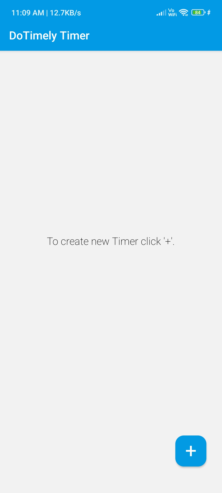
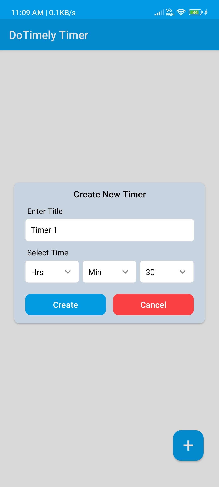
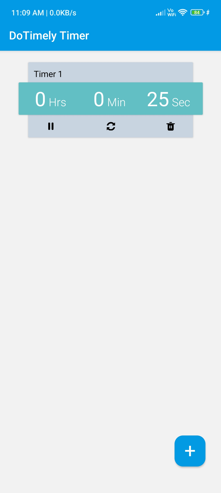
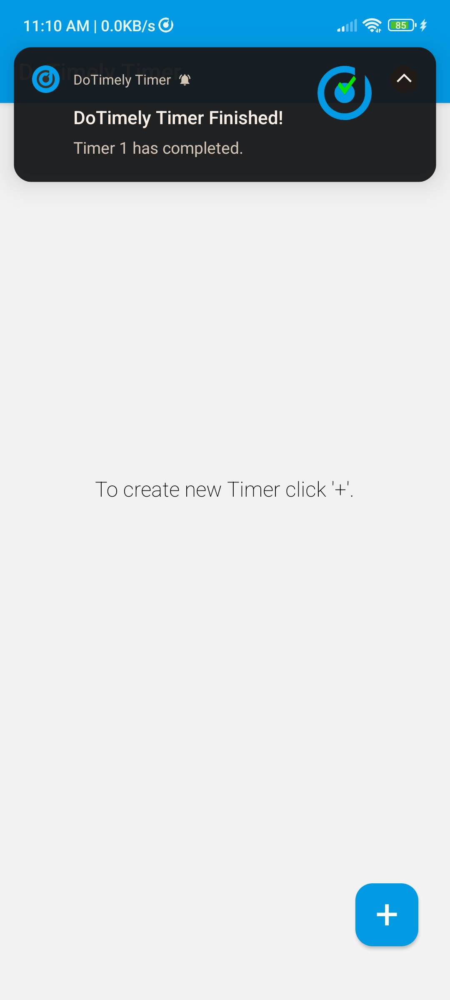

# **DoTimely Timer App**

A React Native application to manage up to 5 timers simultaneously. The app notifies the user when a timer finishes and operates only while the app is in an open state.

---

## **Features**
- Create and manage up to **5 timers** at a time.
- **Local notifications** alert the user when a timer is completed.
- Works only when the app is open, ensuring streamlined focus.
- User-friendly interface with dropdown functionality for easier timer setup.

---

## **Library Used**
- [`@notifee/react-native`](https://www.npmjs.com/package/@notifee/react-native) - Used for handling local notifications when a timer finishes.
- [`react-native-element-dropdown`](https://www.npmjs.com/package/react-native-element-dropdown) - Simplifies the creation of dropdown menus in the app.
- [`react-native-safe-area-context`](https://www.npmjs.com/package/react-native-safe-area-context) - Ensures UI with safe areas on iOS and Android devices.
- [`@react-navigation/native`](https://www.npmjs.com/package/@react-navigation/native) - React Native integration for React Navigation.
- [`@react-navigation/native-stack`](https://www.npmjs.com/package/@react-navigation/native-stack) - Enables stack-based navigation for managing app screens.

---

## **Screenshots**

  &nbsp
  &nbsp 
  &nbsp
  &nbsp
   

